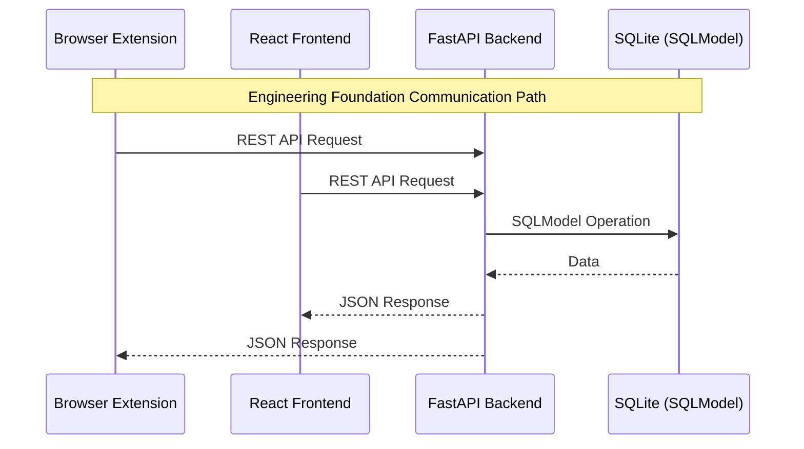

# Project-X

A full-stack engineering foundation project integrating a FastAPI backend, React frontend, and Chrome browser extension.

## Architecture Overview

Project-X is designed as a modular, scalable application with three main components:

```
┌─────────────────┐     ┌─────────────────┐     ┌─────────────────┐
│  Chrome         │     │  React          │     │  FastAPI        │
│  Extension      │────▶│  Frontend       │────▶│  Backend        │
│  (Manifest V3)  │     │  (Vite + TS)    │     │  (SQLModel)     │
└─────────────────┘     └─────────────────┘     └─────────────────┐
                                                             │
                                                    ┌─────────────────┐
                                                    │  SQLite         │
                                                    │  Database       │
                                                    └─────────────────┘
```

## Project Structure

```
project-x/
├── backend/                # FastAPI application
│   ├── app/
│   │   ├── api/            # Route handlers
│   │   ├── core/           # Configuration, settings
│   │   ├── database/       # DB session foundation
│   │   ├── models/         # SQLModel database models
│   │   ├── schemas/        # Pydantic schemas
│   │   ├── services/       # Service layer
│   │   ├── providers/      # Provider implementations
│   │   ├── learning/       # Learning modules
│   │   ├── memory/         # Memory management
│   │   ├── prompt/         # Prompt engineering
│   │   └── internet/       # Internet connectivity
│   ├── pyproject.toml      # Project configuration and dependencies
│   └── main.py             # FastAPI entry point
├── frontend/               # React + TypeScript + Vite
│   └── README.md
├── extension/              # Chrome Extension (Manifest V3)
│   ├── assets/
│   ├── background/
│   ├── content/
│   ├── popup/
│   └── manifest.json
├── shared/                 # Shared types/configs
├── docs/                   # Architecture documentation
├── tests/                  # Test suite
├── scripts/                # Utility scripts
├── tools/                  # Internal development tools
├── .env.example
├── .gitignore
└── README.md
```

## Getting Started

### Prerequisites

- Python 3.14+
- Node.js 18+
- npm or yarn
- Chrome browser (for extension development)

### Backend Setup

1. Navigate to the backend directory:
   ```bash
   cd backend
   ```

2. Create a virtual environment:
   ```bash
   python -m venv venv
   source venv/bin/activate  # On Windows: venv\Scripts\activate
   ```

3. Install dependencies:
   ```bash
   pip install -e .
   ```

4. Copy `.env.example` to `.env` and configure:
   ```bash
   cp ../.env.example .env
   ```

5. Run the development server:
   ```bash
   uvicorn app.main:app --reload --host 0.0.0.0 --port 8000
   ```

6. Access the API documentation:
   - Swagger UI: http://localhost:8000/api/v1/docs
   - ReDoc: http://localhost:8000/api/v1/redoc

### Frontend Setup

The frontend is currently a placeholder. To initialize:

```bash
cd frontend
npm create vite@latest . -- --template react-ts
npm install
npm run dev
```

### Extension Setup

1. Open Chrome and navigate to `chrome://extensions/`
2. Enable "Developer mode" (toggle in top right)
3. Click "Load unpacked"
4. Select the `extension` directory
5. The extension will appear in your extensions list

## Development

### Backend Development

The backend uses FastAPI with SQLModel for database operations. Key features:

- **Configuration**: Environment-based settings via `pydantic-settings`
- **Database**: SQLite with SQLModel ORM
- **API**: RESTful endpoints with automatic OpenAPI documentation
- **Structure**: Modular architecture with clear separation of concerns

### Extension Development

The extension follows Manifest V3 standards:

- **Background Service Worker**: Handles background tasks and API communication
- **Content Scripts**: Interacts with web page DOM
- **Popup UI**: User interface for extension controls
- **Storage**: Uses Chrome Storage API for persistence

## Communication Flow



## Environment Variables

See `.env.example` for available configuration options:

- `PROJECT_NAME`: Application name
- `VERSION`: Application version
- `API_V1_STR`: API version prefix
- `DATABASE_URL`: Database connection string
- `SECRET_KEY`: Secret key for security
- `VITE_API_URL`: Frontend API URL
- `EXTENSION_ID`: Chrome extension ID

## Testing

### Backend Tests

```bash
cd backend
pytest
```

### Extension Tests

Load the extension in Chrome and test functionality through the popup UI and browser console.

## Documentation

- `PROJECT_BLUEPRINT.md`: Detailed architecture and implementation plan
- `docs/`: Additional documentation and guides

## Contributing

1. Follow the existing code structure and patterns
2. Write tests for new features
3. Update documentation as needed
4. Ensure all components pass linting and tests

## License

[Add your license here]

## Status

🚧 **Foundation Phase** - Core structure and basic functionality being established.